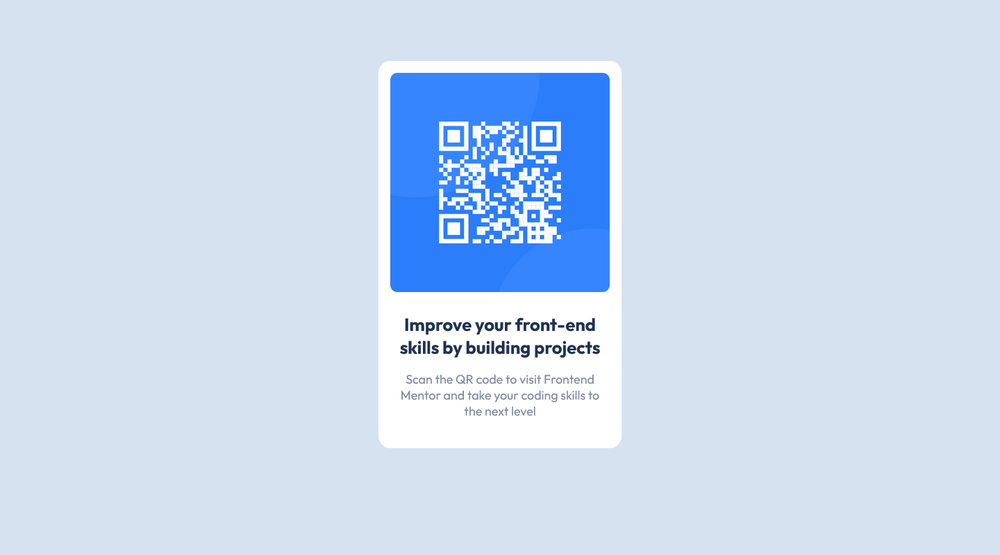

# Frontend Mentor - QR code component solution

This is a solution to the [QR code component challenge on Frontend Mentor](https://www.frontendmentor.io/challenges/qr-code-component-iux_sIO_H). Frontend Mentor challenges help you improve your coding skills by building realistic projects.

## Table of contents

- [Overview](#overview)
  - [Screenshot](#screenshot)
  - [Links](#links)
- [My process](#my-process)
  - [Built with](#built-with)
  - [What I learned](#what-i-learned)
  - [Continued development](#continued-development)
- [Author](#author)

## Overview

### Screenshot

### Links

- Solution URL: [Link GitHub](https://github.com/joanFaseDev/FrontEnd-mentor-projects/tree/master/1.QRCode)
- Live Site URL: [Website](https://joanfasedev.github.io/FrontEnd-mentor-projects/)

## My process

First and foremost, english isn't my first language so please forgive me for any mispellings or grammatical errors.

This challenge was about building a QR code component based on two designs: a desktop and a mobile one. To me, what seems most important in this project's description was the fact that the card's (the component but really it's a card so from now on, i'll call it like that) layout wasn't responsive meaning its desktop's dimensions and mobile's one were the same. Which also means:

1. I could start coding without thinking too much about composition and how some elements were going to interact with others.
2. I could actually use absolute units like pixels more freely because if the card doesn't change size there's less of an overflow's risk.

So the way i worked was pretty basic i think.
First, i created a container with an image and two paragraphs elements. My first intent was to use the container as a flexbox then to aligned all its childrens properly but there was only four elements to manage (container included) and in the end flexbox seemed like an overkill here so i didn't used it.
For the visual part, i tried to apply some basic CSS rules i read or heard. Things like limiting as much as possible the use of the _height_ property (i didn't use it, when i needed my container to gain height i did it through padding), using mainly relative units like percentage as value for the _width_ property (here i ended up using pixels because again the card's design is the same on desktop/mobile so using absolute unit just makes more sense), etc,... Not much more to say here, after all it's a small project (perfect for a beginner like me).

### Built with

- 'Regular' HTML5 markup (no semantic one)
- CSS

### What I learned

- What i learned from this project is not really technical stuff but more like insight from the job itself. It never occured to me that front-end developper had to stick to models/templates built by others to design their web pages / apps. I did some research and ended up on Josh Comeau's blog where i read a couple of articles (honestly i felt it was way beyond me but it did a great job at depicting a front-end developper's trade) which were really inspiring. This project is basic but it really made me aware of the fact that i know very little about front-end developement. It also made me want to know more which is a good thing i think.
- I also 'learned' about time management or to be honest my lack of time management. Clearly something i need to work on.
- Finally i feel like a learned 'active learning' which is basically, in web development, the fact to learn through pratice, exercice and repetition instead of a more passive 'watching tutorials a lot' way.

### Continued development

For now, i want to stick to basic CSS stuff:

- How to use relative length units like em, rem, vh and vw effectively and by that i mean, what unit should i choose, how should i use it and in what situation.
- Use of media queries, what property should be focused (min-width, max-width,...), should i start to plan the mobile design first or the desktop one, etc,...

One thing i plan to learn in the following days is Sass and the use of CSS variables. I honestly don't think i need it for small project but i also know that it can saves a lot of time if used properly and time management is something i'm really interested in.

Finally, i want to found out more about naming convention like BEM and the like. I'm really bad at naming classes and i feel like it's going to bite me in the back later on the road so better to solve that problem as soon as possible.

If you read until that point, well thanks a lot! I didn't expect feedbacks on that project because of its size, because of the fact that i didn't formally asked for it or made any real effort for people to give me some. BUT if you feel like commenting on anything i did really, by all means don't hesitate for i'll be sure to read it.

## Author

- Website - [Jordan](https://joanfasedev.github.io/FrontEnd-mentor-projects/)
- Frontend Mentor - [@joanfaseDev](https://www.frontendmentor.io/profile/joanFaseDev)
